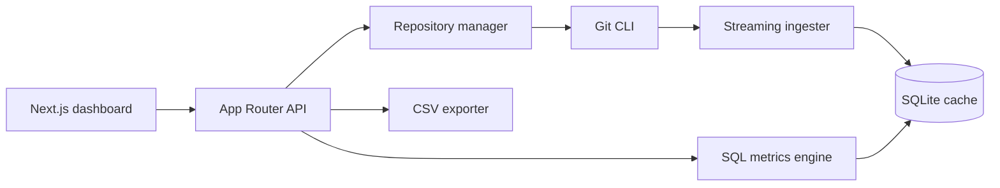

# RAT — Repo Analysis Tool

A dark-themed web dashboard for measuring how a Git repository evolves: which files and directories change, who changes them, how frequently they change, and who owns the churn.

RAT accepts a remote Git URL or a zip containing a `.git` directory, analyzes the full non-merge history, and presents repository, directory, file, commit-set, and author metrics.

> COMS3011A Software Design Project · Student repository: `2662523SDP`

## Quick start

### Prerequisites

| Requirement | Notes |
| --- | --- |
| Linux x86-64 | Tested on Ubuntu 24.04 |
| Node.js | 18.18 or newer; tested with 18.19.1 |
| npm | Included with Node.js; tested with npm 9 |
| Git CLI | Must be available as `git` |
| unzip | Required for zip ingestion |

No environment variables, external database, migrations, or third-party service credentials are required.

### Development

```bash
git clone https://github.com/Aperin27/2662523SDP.git
cd 2662523SDP
npm ci --python=/usr/bin/python3
npm run dev
```

Open [http://localhost:3000](http://localhost:3000).

### Production build

```bash
npm ci --python=/usr/bin/python3
npm run build
npm start
```

The production server also runs at [http://localhost:3000](http://localhost:3000) by default.

On first use, RAT creates its SQLite database and data directories automatically under `data/`. Nothing needs to be configured manually.

## Using the application

### 1. Add a repository

From the home page, choose either ingestion method:

- **Clone URL** — enter a public remote URL, for example `https://github.com/DaveGamble/cJSON.git`. RAT performs a full clone; it never uses a shallow history.
- **Zip upload** — upload a `.zip` archive that contains the repository's `.git` directory. The repository may be at the archive root or inside one top-level directory.

Both forms accept an optional reference or full commit SHA. If omitted, RAT analyzes `HEAD`.

Ingestion runs in the background. The UI remains responsive and displays live commit progress while the Git history is streamed into SQLite.

### 2. Explore metrics

Select a ready repository to open its dashboard. The dashboard provides:

- Repository-wide summary cards
- Clickable directory navigation and breadcrumb paths
- Sortable file and directory tables
- Per-author metrics and ownership bars
- Author filtering in the ownership table
- Commit-set filtering by all history, a time range, or a manual list of full commit SHAs
- CSV export for the selected commit set

Time ranges use the Git **committer date** and `[from, to)` semantics: the start is inclusive and the end is exclusive.

### 3. Merge author identities

RAT automatically asks Git to apply the repository's `.mailmap`. If identities still need consolidation, use **Merge authors** at the bottom of the repository dashboard. Existing merge chains are flattened when a new merge is saved.

### 4. Manage multiple repositories

Each repository has isolated commits, changes, authors, objects, jobs, and metrics. Use the home page to switch repositories or archive entries that are no longer needed. Archiving hides an entry from the default repository list without deleting its local data.

## Metrics

For a commit set `H` and an object `o` (file, directory, or repository root):

| Metric | Symbol | Definition |
| --- | ---: | --- |
| Added lines | `l⁺` | Sum of added lines |
| Removed lines | `l⁻` | Sum of removed lines |
| Growth | `δ` | `l⁺ − l⁻` |
| Churn | `λ` | `l⁺ + l⁻` |
| Modifications | `n` | Commits in `H` where the object has non-zero churn |
| Modification frequency | `η` | `n / \|H\|`, or `0` when `H` is empty |
| Churn rate | `ρ` | `λ / \|H\|`, or `0` when `H` is empty |
| Author ownership | `ω` | Author churn divided by total churn, or `0` when total churn is zero |

Directory values are recursive rollups of their files and immediate child directories. Repository values are the directory metrics for the root.

### Git semantics

The implementation follows the project specification's Git behavior:

- Only non-merge commits reachable from the selected reference are measured.
- Root commits are compared with an empty tree.
- Binary files, as detected by Git, are excluded.
- Rename detection uses Git's 50% similarity threshold (`-M50%`).
- Pure renames add no churn.
- Rename-and-edit changes are attributed to the new path.
- Deleted-file removals remain attributed to the deleted path.
- `.mailmap` author resolution is applied by Git before ingestion.

## Architecture



RAT uses a cache-first architecture:

1. The repository manager performs a deep clone or extracts and validates an uploaded zip.
2. The ingester streams `git log --numstat` output instead of loading the entire history into memory.
3. Batched SQLite transactions store commits and file changes, while directory changes are rolled up once during ingestion.
4. The dashboard, API, CSV exporter, self-test, and reference comparator all call the same metrics module. There is no duplicate metric implementation.
5. Metrics are SQL aggregations over cached rows; Git history is not recomputed for every page request.

This architecture keeps browsing and filtering fast after a one-time ingestion cost.

### Persistence

All runtime data is local and gitignored:

| Path | Purpose |
| --- | --- |
| `data/app.db` | SQLite database |
| `data/repos/` | Deep clones and extracted repositories |
| `data/uploads/` | Temporary upload storage; archives are deleted after extraction |

Restarting the server preserves completed repositories and metrics. Deleting `data/` resets the application completely; RAT recreates it on the next run.

## Project structure

```text
app/
├── api/repos/                 Repository, metric, author, zip, and CSV routes
├── repos/[id]/page.tsx        Repository dashboard
├── page.tsx                   Repository list and ingestion forms
└── ui.tsx                     Shared visual components and styles
lib/
├── db.ts                      SQLite connection and schema
├── git.ts                     Git CLI streaming and numstat parsing
├── ingest.ts                  Batched commit ingestion and directory rollups
├── metrics.ts                 Single source of truth for all metrics
└── repos.ts                   Repository lifecycle and background jobs
scripts/
├── selftest.ts                Synthetic Git edge-case test suite
├── compare.ts                 Reference CSV comparator
└── add-local.ts               Local development ingestion helper
```

## API overview

| Method | Route | Purpose |
| --- | --- | --- |
| `GET` | `/api/repos` | List repositories |
| `POST` | `/api/repos` | Add a remote repository |
| `POST` | `/api/repos/zip` | Upload a repository zip |
| `GET` | `/api/repos/:id` | Repository and ingest-job status |
| `PATCH` | `/api/repos/:id` | Archive or restore a repository |
| `GET` | `/api/repos/:id/metrics` | Object metrics and immediate children |
| `GET` | `/api/repos/:id/authors` | List canonical authors |
| `POST` | `/api/repos/:id/authors` | Merge author identities |
| `GET` | `/api/repos/:id/export` | Export metrics as CSV |

## Verification

### Automated checks

```bash
npm run selftest
npm run lint
npm run build
```

The synthetic self-test covers 29 assertions, including:

- Root, modify, delete, pure-rename, rename-and-edit, binary, and merge commits
- `.mailmap` and manual author merging
- Repository and directory rollups
- Manual commit sets and inclusive/exclusive time boundaries
- Modification frequency, churn rate, ownership, and empty-set zero guards

> `npm run selftest` creates a synthetic repository entry in the local `data/app.db`. Runtime data is gitignored and does not affect the submitted source.

### Reference-data validation

The metrics engine was compared directly against the provided CSV references, using the same `lib/metrics.ts` functions used by the live dashboard and API:

| Repository | Non-merge commits | Field checks matched | Result |
| --- | ---: | ---: | ---: |
| cJSON | 955 | 6,189 / 6,189 | 100% |
| Git | 61,101 | 383,215 / 383,215 | 100% |
| Redis | 11,874 | 112,850 / 112,874 | 99.98% |

The 24 Redis field differences are confined to two vendored jemalloc files in one large vendor-update commit, where Git's global similarity matching chooses a different valid rename pairing. All other Redis fields match.

Observed ingestion times on the development machine were approximately 0.3 seconds for cJSON, 9.2 seconds for Redis, and 32.4 seconds for Git. Results vary by machine and disk.

If the provided reference CSVs are available locally, run:

```bash
npm run compare -- <repository-id-or-slug> <path-to-reference.csv>
```

## Troubleshooting

### `better-sqlite3` installation fails

A prebuilt binary is normally installed automatically. If npm falls back to `node-gyp`, ensure Python and standard build tools are available. On this tested environment, explicitly selecting system Python resolves Anaconda-related `gyp` failures:

```bash
npm ci --python=/usr/bin/python3
```

### Port 3000 is already in use

Start on another port:

```bash
npm run dev -- -p 3001
```

### A zip is rejected

Confirm that:

- The uploaded file ends in `.zip`.
- The archive includes the repository's `.git` directory or `.git` file.
- The repository is at the archive root or inside one top-level directory.
- The system `unzip` command is installed.

A GitHub **source-code archive** generated from the Releases page usually omits `.git` and therefore cannot be analyzed. Zip the actual local clone instead.

### A remote clone fails

Confirm the URL is reachable by the system Git client. Private repositories are not supported because the application does not collect credentials. Clone the repository locally and upload a zip containing `.git` instead.

## Known operational limitations

- Ingestion jobs run in the Next.js server process. Stopping that process interrupts an active job; completed repository data remains persistent.
- Very large repositories require more ingestion time and local disk space because RAT analyzes full history.
- Manual commit selection currently expects full commit SHAs.
- Uploaded archives are trusted local input for this coursework application; run the app only in a controlled environment.

## Technology

- Next.js 15 App Router and React 19
- TypeScript
- Tailwind CSS 4
- SQLite via `better-sqlite3`
- System Git CLI

---

Built for the COMS3011A Repo Analysis Tool brief.
